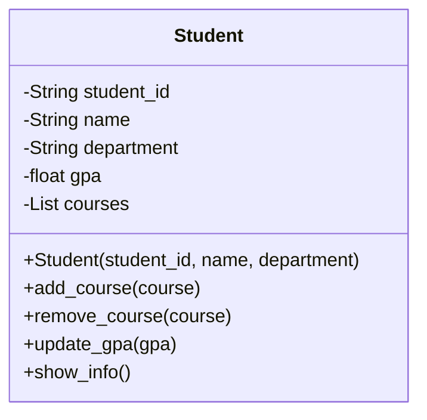

# AII003

Student Class Diagram Homework

## Student Class Diagram

This diagram shows the `Student` class implemented in `student.py`.

```mermaid
classDiagram
    class Student {
        -String student_id
        -String name
        -String department
        -float gpa
        -List courses

        +Student(student_id, name, department)
        +add_course(course)
        +remove_course(course)
        +update_gpa(gpa)
        +show_info()
    }
```
